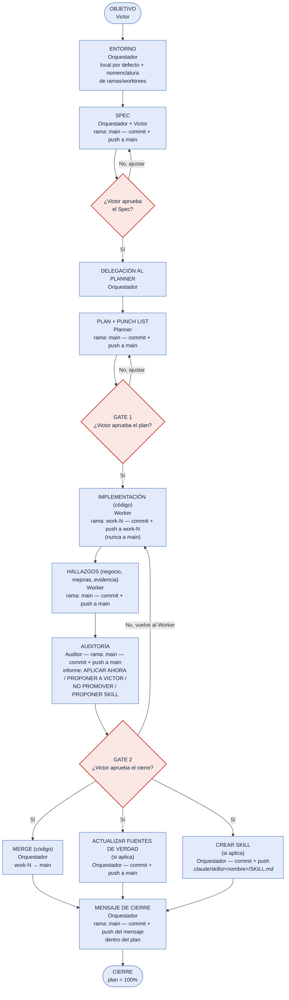

# Diagrama — Commit / Push / Merge / Gates durante la implementación

> Versión completa: del objetivo de Victor al cierre, una sola línea, sin cruces. Complementa `2026-09-27-reestructuracion-documental-y-estandar-de-trabajo.md`.

## Tabla — quién hace qué, en qué rama, y qué pasa en Git

| Paso | Quién lo hace | Repositorio | Rama | Qué pasa en Git | Cuándo | Qué debe leer antes (mínimo, sin leer de más) |
|---|---|---|---|---|---|---|
| **OBJETIVO** | Victor | — | — | — | inicia la sesión | — |
| **ENTORNO** (local por defecto, nomenclatura de ramas/worktrees) | Orquestador | pg_control_proyectos | `main` | (todavía nada que commitear) | justo después del objetivo | `AGENTS.md`, `docs/README.md`, `00-estandar-agentes/00-indice.md` + índice de `03-aprendizaje-continuo/` |
| **SPEC** | Orquestador + Victor | pg_control_proyectos | `main` | commit + push directo a `main` | al redactar el Spec | lo de arriba, ya leído |
| *(GATE SPEC — Victor aprueba el Spec?)* | Victor | — | — | — | antes de planificar | el Spec redactado |
| **DELEGACIÓN** al Planner | Orquestador | — | — | (acción de asignación, sin archivo nuevo) | al aprobarse el Spec | el Spec aprobado |
| **PLAN** (+ Punch List, un solo archivo) | Planner | pg_control_proyectos | `main` | commit + push directo a `main` | al quedar listo para Gate 1 | el Spec + los flujos de negocio (`04-flujos-de-negocio/`) que toca el tema + plantillas `02-plan.md`/`05-punch-list.md` + índice de `03-aprendizaje-continuo/` |
| *(GATE 1 — Victor aprueba el plan)* | Victor | — | — | — | antes de implementar | el archivo de plan completo |
| **IMPLEMENTACIÓN** (código) | Worker | py_control_proyectos_web | `<entorno>-worker-N` | commit + push a su rama (nunca a `main`) | cada avance (~35%) | el plan + solo los flujos de negocio que su parte toca + `design.md` si es UI + la mejora puntual de `03-aprendizaje-continuo/` justo antes de la acción que cubre |
| **HALLAZGOS** (negocio, mejoras, evidencia) | Worker | pg_control_proyectos | `main` | commit + push directo a `main` | antes de entregar el resultado | mismo contexto — sin lectura nueva |
| **AUDITORÍA** (informe: `APLICAR AHORA` / `PROPONER A VICTOR` / `NO PROMOVER` / **`PROPONER SKILL`**) | Auditor | pg_control_proyectos | `main` | commit + push directo a `main` | al terminar de revisar | el plan + progreso + evidencia + flujos de negocio tocados + índice de `03-aprendizaje-continuo/` |
| *(GATE 2 — Victor aprueba el cierre, incluidas las propuestas del Auditor)* | Victor | — | — | — | antes de publicar | el Informe de Auditoría |
| **MERGE** (código) | Orquestador | py_control_proyectos_web | `<entorno>-worker-N` → `main` | **merge** | tras Gate 2, junto con las 2 filas de abajo | el Informe de Auditoría |
| **ACTUALIZAR FUENTES DE VERDAD** (solo si el Auditor propuso y Victor aprobó) | Orquestador | pg_control_proyectos | `main` | commit + push a `main` (AGENTS.md / README raíz / docs/README.md / estándar) | tras Gate 2, en paralelo | la propuesta puntual del Auditor |
| **CREAR SKILL** (solo si el Auditor propuso `PROPONER SKILL` y Victor aprobó) | Orquestador | pg_control_proyectos y/o el repo donde se usará | `main` | commit + push de `.claude/skills/<nombre>/SKILL.md`, redactado de forma agnóstica (copiable a otros repos) | tras Gate 2, en paralelo | la propuesta del Auditor + la mejora original que lo origina |
| **MENSAJE DE CIERRE** | Orquestador | pg_control_proyectos | `main` | commit + push del mensaje de cierre (confirma merge + fuentes de verdad + skill, si aplica, + 100% pusheado) **dentro del propio archivo del plan** | tras las 3 filas de arriba | el propio archivo de plan |

### Regla general de lectura mínima

Ningún rol lee todo `docs/` de entrada. Cada uno lee: (1) el estándar que le corresponde a su rol, (2) el archivo de plan/progreso/evidencia del tema activo, (3) **solo** los flujos de negocio o el `design.md` que el plan indica afectados, y (4) el **índice** (no el contenido completo) de `03-aprendizaje-continuo/` — abriendo una mejora puntual completa solo cuando su etiqueta coincide con lo que se está por hacer. Victor no tiene lectura obligatoria: decide el objetivo y aprueba en los Gates con lo que el rol correspondiente le presenta.

## Mismo flujo, en diagrama (una sola línea, sin cruces)

**Léelo así, de arriba a abajo:** Victor plantea el objetivo → Orquestador define entorno y nomenclatura → nace el Spec → (¿Victor dice sí?) → el Orquestador delega al Planner → Plan + Punch List → (¿Victor dice sí, Gate 1?) → Worker programa en su propia rama → Worker anota hallazgos en este repo → Auditor revisa y propone (incluyendo, si corresponde, convertir una mejora repetida en Skill) → (¿Victor dice sí, Gate 2?) → **tres cosas ocurren a la vez**: se mergea el código, se pushean los cambios aprobados a fuentes de verdad, y se crea el Skill si el Auditor lo propuso → el Orquestador escribe el mensaje de cierre dentro del propio plan → cierre. Las únicas flechas que "suben" son cuando Victor dice **No** en un Gate.
