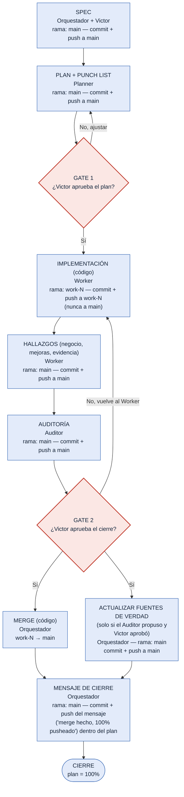

# Diagrama — Commit / Push / Merge / Gates durante la implementación

> Versión simple: una sola línea, sin cruces. Complementa `2026-09-27-reestructuracion-documental-y-estandar-de-trabajo.md`.

## Tabla — quién hace qué, en qué rama, y qué pasa en Git

| Paso | Quién lo hace | Repositorio | Rama | Qué pasa en Git | Cuándo | Qué debe leer antes (mínimo, sin leer de más) |
|---|---|---|---|---|---|---|
| **SPEC** | Orquestador + Victor | pg_control_proyectos | `main` | commit + push directo a `main` | al aprobar Victor el Spec | `AGENTS.md`, `docs/README.md`, `00-estandar-agentes/00-indice.md` + **índice** (solo títulos/etiquetas) de `03-aprendizaje-continuo/README.md`, por si algo de entorno/sesión ya está registrado como lección conocida |
| **PLAN** (+ Punch List) | Planner | pg_control_proyectos | `main` | commit + push directo a `main` | al quedar listo para Gate 1 | el Spec/SDD aprobado + los flujos de negocio (`04-flujos-de-negocio/`) que toca el tema + plantillas `02-plan.md`/`05-punch-list.md` + **índice** de `03-aprendizaje-continuo/` para anexar advertencias técnicas conocidas si el tema toca algo ya registrado (ej. migraciones SQL) |
| *(GATE 1 — Victor aprueba el plan)* | Victor | — | — | — | antes de implementar | el archivo de plan completo (`01-planes/<tema>.md`) |
| **IMPLEMENTACIÓN** (código) | Worker | py_control_proyectos_web | `<entorno>-worker-N` | commit + push a su rama (nunca a `main`) | cada avance (~35%) | el plan completo + solo los flujos de negocio que su parte del plan toca + `design.md` únicamente si su tarea es de UI + la mejora **puntual** de `03-aprendizaje-continuo/` justo antes de la acción que esa mejora cubre (ej. antes de correr una migración, antes de verificar con Playwright) |
| **HALLAZGOS** (negocio, mejoras, evidencia) | Worker | pg_control_proyectos | `main` | commit + push directo a `main` | antes de entregar el resultado | mismo contexto que implementación — no agrega lectura nueva |
| **AUDITORÍA** (informe) | Auditor | pg_control_proyectos | `main` | commit + push directo a `main` | al terminar de revisar | el plan + progreso + evidencia del tema + los flujos de negocio que el plan dice haber tocado + **índice** de `03-aprendizaje-continuo/` para confirmar que no se ignoró una lección ya conocida y aplicable |
| *(GATE 2 — Victor aprueba el cierre)* | Victor | — | — | — | antes de publicar | el Informe de Auditoría |
| **MERGE** (código) | Orquestador | py_control_proyectos_web | `<entorno>-worker-N` → `main` | **merge** | solo tras Gate 2 — ocurre en paralelo con la fila de abajo | el Informe de Auditoría (confirma que Gate 2 ya se aprobó) |
| **ACTUALIZAR FUENTES DE VERDAD** (solo si el Auditor propuso cambios y Victor los aprobó) | Orquestador | pg_control_proyectos | `main` | commit + push directo a `main` (AGENTS.md / README raíz / docs/README.md / estándar) | junto con el merge, tras Gate 2 | la propuesta puntual del Auditor + el documento de fuente de verdad a modificar (no el resto) |
| **MENSAJE DE CIERRE** | Orquestador | pg_control_proyectos | `main` | commit + push del mensaje de cierre (confirma merge hecho + 100% pusheado) **registrado dentro del propio archivo del plan** | inmediatamente después de las dos filas de arriba | el propio archivo de plan (para escribir el cierre ahí) |

### Regla general de lectura mínima

Ningún rol lee todo `docs/` de entrada. Cada uno lee: (1) el estándar que le corresponde a su rol, (2) el archivo de plan/progreso/evidencia del tema activo, (3) **solo** los flujos de negocio o el `design.md` que el plan indica que están afectados, y (4) el **índice** (no el contenido completo) de `03-aprendizaje-continuo/` — abriendo el contenido completo de una mejora puntual únicamente cuando su etiqueta coincide con lo que se está por hacer. Nunca se leen los 21 flujos completos ni todas las mejoras por defecto. Victor no tiene lectura obligatoria: decide el objetivo y aprueba en los Gates con lo que el rol correspondiente le presenta.

## Mismo flujo, en diagrama (una sola línea, sin cruces)

**Léelo así, de arriba a abajo:** Spec → Plan → (¿Victor dice sí?) → Worker programa en su propia rama → Worker anota hallazgos en este repo → Auditor revisa → (¿Victor dice sí?) → **dos cosas ocurren a la vez**: se mergea el código a `main`, y si el Auditor propuso cambios a una fuente de verdad y Victor los aprobó, también se pushean a `main` → recién con ambas listas, el Orquestador escribe el mensaje de cierre (merge hecho + 100% pusheado) dentro del propio archivo del plan → cierre. Las dos únicas flechas que "suben" son cuando Victor dice **No** en un Gate — ahí se vuelve al paso de antes, nada más.
