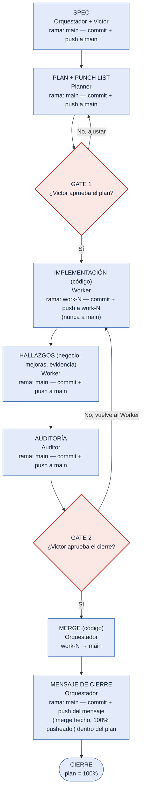

# Diagrama — Commit / Push / Merge / Gates durante la implementación

> Versión simple: una sola línea, sin cruces. Complementa `2026-09-27-reestructuracion-documental-y-estandar-de-trabajo.md`.

## Tabla — quién hace qué, en qué rama, y qué pasa en Git

| Paso | Quién lo hace | Repositorio | Rama | Qué pasa en Git | Cuándo |
|---|---|---|---|---|---|
| **SPEC** | Orquestador + Victor | pg_control_proyectos | `main` | commit + push directo a `main` | al aprobar Victor el Spec |
| **PLAN** (+ Punch List) | Planner | pg_control_proyectos | `main` | commit + push directo a `main` | al quedar listo para Gate 1 |
| *(GATE 1 — Victor aprueba el plan)* | Victor | — | — | — | antes de implementar |
| **IMPLEMENTACIÓN** (código) | Worker | py_control_proyectos_web | `<entorno>-worker-N` | commit + push a su rama (nunca a `main`) | cada avance (~35%) |
| **HALLAZGOS** (negocio, mejoras, evidencia) | Worker | pg_control_proyectos | `main` | commit + push directo a `main` | antes de entregar el resultado |
| **AUDITORÍA** (informe) | Auditor | pg_control_proyectos | `main` | commit + push directo a `main` | al terminar de revisar |
| *(GATE 2 — Victor aprueba el cierre)* | Victor | — | — | — | antes de publicar |
| **MERGE** (código) | Orquestador | py_control_proyectos_web | `<entorno>-worker-N` → `main` | **merge** | solo tras Gate 2 |
| **MENSAJE DE CIERRE** | Orquestador | pg_control_proyectos | `main` | commit + push del mensaje de cierre (confirma merge hecho + 100% pusheado) **registrado dentro del propio archivo del plan** | inmediatamente después del merge |

## Mismo flujo, en diagrama (una sola línea, sin cruces)

**Léelo así, de arriba a abajo:** Spec → Plan → (¿Victor dice sí?) → Worker programa en su propia rama → Worker anota hallazgos en este repo → Auditor revisa → (¿Victor dice sí?) → se mergea el código → el Orquestador escribe el mensaje de cierre (merge hecho + 100% pusheado) dentro del propio archivo del plan → cierre. Las dos únicas flechas que "suben" son cuando Victor dice **No** en un Gate — ahí se vuelve al paso de antes, nada más.
