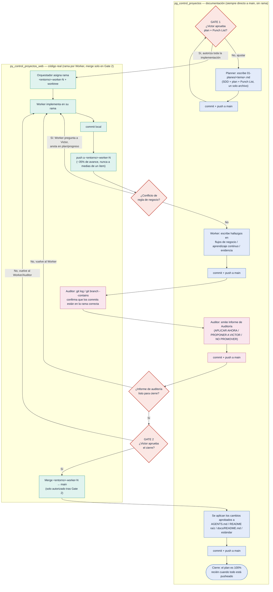

# Diagrama — Commit / Push / Merge / Gates durante la implementación

> Complementa `2026-09-27-reestructuracion-documental-y-estandar-de-trabajo.md` y el flujo SDD→Cierre. Este diagrama se enfoca solo en la mecánica de Git y los dos Gates de Victor, separando los dos repositorios involucrados. Se renderiza automáticamente al ver este archivo en GitHub.

## Lectura rápida

- **Azul (DOCS)** = escritura directa a `main` en este repositorio, sin rama ni merge — es documentación de proceso, no código.
- **Verde (CODE)** = trabajo real de Worker en `py_control_proyectos_web`, siempre en su rama `<entorno>-worker-N`, nunca en `main` hasta el merge.
- **Rosa** = acciones del Auditor (chequeo de rama + informe).
- **Rojo** = los dos Gates de Victor y las dos decisiones internas (conflicto de negocio, informe listo) — son los únicos puntos donde el camino puede volver atrás.
- El **merge** (`P`) ocurre una sola vez, después del Gate 2 — es el único paso que realmente publica el código en `main`.
