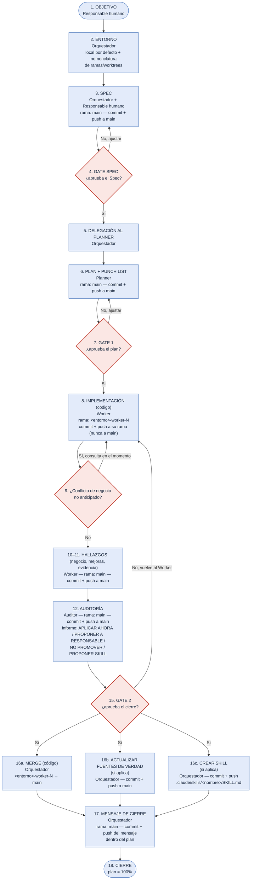

# Flujo SDD y planes — Objetivo a Cierre

> **Fuente normativa del flujo de trabajo con Orquestador/Planner/Worker/Auditor (D1).** Si un plan, un progreso o un artifact derivado difiere de lo que dice este documento, se corrige el plan o el artifact — nunca este documento. Si este documento no cubre un punto, aplica el plan activo. Documento agnóstico: no nombra personas, repositorios ni rutas propias de ningún proyecto — esos datos viven en `01-contexto-repositorio/` de cada repositorio que use este estándar.

## Diferencia entre chat normal y plan de implementación

Una conversación simple (pregunta, análisis, corrección puntual) no activa este flujo. El flujo de Objetivo a Cierre se activa cuando el Responsable humano pide trabajar con un plan gestionado por roles (Orquestador, Planner, Worker, Auditor) — típicamente un cambio con varias fases, que toca más de un archivo o componente, o que requiere aprobación explícita antes de ejecutar.

### Respuesta de activación del Orquestador

Cuando el Responsable humano activa este flujo, el Orquestador responde con el texto siguiente (adaptable en el nombre del rol si el estándar se copia a otro contexto, pero conservando la estructura: confirmación, secuencia completa, y la primera pregunta):

```text
✅ Orquestador activo.

Trabajaremos con este flujo:
Objetivo → Planificación → Aprobación → Implementación →
Auditoría documental → Revisión del Responsable humano → Cierre.

Primero definamos el objetivo de la tarea.
¿Qué quieres lograr, qué no debe cambiar y cómo sabremos que está terminado?
```

## Secuencia unificada (18 pasos)

```text
 1. Objetivo — Responsable humano
 2. Entorno — Orquestador define local (por defecto) o nube, y la nomenclatura de ramas/worktrees; revisa recursos libres antes de pedir crear nuevos
 3. Spec/SDD — Orquestador + Responsable humano (plantilla 01-spec-sdd) → commit + push a main
 4. GATE SPEC — ¿aprueba el Spec?   No → vuelve a 3
 5. Delegación al Planner — Orquestador (el Spec aprobado es la entrada)
 6. Plan + Punch List — Planner, en el único archivo de plan; anticipa conflictos de negocio revisando los flujos afectados → commit + push a main
 7. GATE 1 — ¿aprueba plan + Punch List?   No → vuelve a 6.   Sí → autoriza toda la implementación, sin aprobaciones intermedias
 8. Implementación — Worker, en su rama <entorno>-worker-N (código) → commit + push a su rama cada ~35%, nunca a medias de un ítem, nunca a main
 9. ¿Conflicto de regla de negocio no anticipado? Sí → el Worker consulta al Responsable humano en su propio chat, en el momento, y registra pregunta y respuesta en el progreso; vuelve a 8
10. Verificación y evidencia — Worker: pruebas de interfaz cuando aplica (nunca solo por código), Punch List completada, archivo de evidencia + enlace al artifact de checklist visual si existe
11. Consolidar hallazgos — Worker: escribe reglas de negocio validadas, aprendizajes y evidencia (commit + push a main del repositorio de documentación); deja anotado lo que toque fuentes de verdad centrales
12. Auditoría — Auditor: primero confirma con git log / git branch --contains que los commits están en la rama del Worker asignado; luego revisa SDD, plan, Punch List y evidencia. Informe: APLICAR AHORA / PROPONER A RESPONSABLE / NO PROMOVER / PROPONER SKILL
13. ¿Informe listo para cierre?   No → vuelve a 8
14. Orquestador consolida y presenta — informe + resultados + propuestas de cambio a fuentes de verdad centrales
15. GATE 2 — ¿aprueba el cierre?   No → vuelve a 8
16. Tres acciones independientes (cualquier orden, cada una solo si aplica):
    a. Merge <entorno>-worker-N → main del repositorio de código
    b. Cambios aprobados a fuentes de verdad centrales → commit + push a main
    c. Skill aprobado → .claude/skills/<nombre>/SKILL.md, redactado de forma agnóstica
17. Mensaje de cierre — Orquestador, dentro del propio archivo del plan: confirma qué ocurrió de 16a–16c y que todo quedó pusheado → commit + push a main
18. Cierre — el plan es 100% recién cuando todo está pusheado/mergeado; el archivo del plan nunca se borra ni se resume
```

Las únicas flechas que "suben" son cuando el Responsable humano dice **No** en un Gate.

## Tabla — quién hace qué, en qué rama, y qué pasa en Git

Columna "Qué debe leer antes": ver la regla de lectura mínima más abajo. **Excepción de lectura por rol (D10):** el Orquestador, el Planner y el Auditor leen todos los flujos de negocio del repositorio de documentación; el Worker lee solo los que el plan indica afectados por su parte.

| Paso | Quién lo hace | Repositorio | Rama | Qué pasa en Git | Cuándo | Qué debe leer antes (mínimo, sin leer de más) |
|---|---|---|---|---|---|---|
| **1. OBJETIVO** | Responsable humano | — | — | — | inicia la sesión | — |
| **2. ENTORNO** (local por defecto, nomenclatura de ramas/worktrees) | Orquestador | repositorio de documentación | `main` | (todavía nada que commitear) | justo después del objetivo | el estándar (`00-indice.md`) + índice de aprendizaje continuo |
| **3. SPEC** | Orquestador + Responsable humano | repositorio de documentación | `main` | commit + push directo a `main` | al redactar el Spec | lo de arriba, ya leído |
| *(4. GATE SPEC — ¿aprueba el Spec?)* | Responsable humano | — | — | — | antes de planificar | el Spec redactado |
| **5. DELEGACIÓN** al Planner | Orquestador | — | — | (acción de asignación, sin archivo nuevo) | al aprobarse el Spec | el Spec aprobado |
| **6. PLAN** (+ Punch List, un solo archivo) | Planner | repositorio de documentación | `main` | commit + push directo a `main` | al quedar listo para Gate 1 | el Spec + **todos** los flujos de negocio + plantillas `02-plan.md`/`05-punch-list.md` + índice de aprendizaje continuo |
| *(7. GATE 1 — ¿aprueba el plan?)* | Responsable humano | — | — | — | antes de implementar | el archivo de plan completo |
| **8. IMPLEMENTACIÓN** (código) | Worker | repositorio de código | `<entorno>-worker-N` | commit + push a su rama (nunca a `main`) | cada avance (~35%) | el plan + **solo** los flujos de negocio que su parte toca + `design.md` si es UI + la mejora puntual de aprendizaje continuo justo antes de la acción que cubre |
| **9. CONSULTA DE NEGOCIO** (si aplica) | Worker | — | — | — | ante un conflicto no anticipado | el punto exacto del flujo que entra en conflicto |
| **10–11. HALLAZGOS** (negocio, mejoras, evidencia) | Worker | repositorio de documentación | `main` | commit + push directo a `main` | antes de entregar el resultado | mismo contexto — sin lectura nueva |
| **12. AUDITORÍA** (informe: `APLICAR AHORA` / `PROPONER A RESPONSABLE` / `NO PROMOVER` / **`PROPONER SKILL`**) | Auditor | repositorio de documentación | `main` | commit + push directo a `main` | al terminar de revisar | el plan + progreso + evidencia + **todos** los flujos de negocio + índice de aprendizaje continuo |
| *(15. GATE 2 — ¿aprueba el cierre?)* | Responsable humano | — | — | — | antes de publicar | el Informe de Auditoría |
| **16a. MERGE** (código) | Orquestador | repositorio de código | `<entorno>-worker-N` → `main` | **merge** | tras Gate 2, junto con las 2 filas de abajo | el Informe de Auditoría |
| **16b. ACTUALIZAR FUENTES DE VERDAD** (solo si el Auditor propuso y el Responsable humano aprobó) | Orquestador | repositorio de documentación | `main` | commit + push a `main` (fuentes de verdad centrales / estándar) | tras Gate 2, en paralelo | la propuesta puntual del Auditor |
| **16c. CREAR SKILL** (solo si el Auditor propuso `PROPONER SKILL` y el Responsable humano aprobó) | Orquestador | repositorio de documentación y/o el repositorio donde se usará | `main` | commit + push de `.claude/skills/<nombre>/SKILL.md`, redactado de forma agnóstica (copiable a otros repos) | tras Gate 2, en paralelo | la propuesta del Auditor + la mejora original que lo origina |
| **17. MENSAJE DE CIERRE** | Orquestador | repositorio de documentación | `main` | commit + push del mensaje de cierre (confirma merge + fuentes de verdad + skill, si aplica, + 100% pusheado) **dentro del propio archivo del plan** | tras las 3 filas de arriba | el propio archivo de plan |
| **18. CIERRE** | — | — | — | — | — | plan = 100% |

### Regla general de lectura mínima

Ningún rol lee todo el árbol de documentación de entrada. Cada uno lee: (1) el estándar que le corresponde a su rol, (2) el archivo de plan/progreso/evidencia del tema activo, (3) los flujos de negocio o el `design.md` según la excepción de lectura por rol de arriba (**D10**: Orquestador, Planner y Auditor — todos los flujos; Worker — solo los que el plan indica afectados por su parte), y (4) el **índice** (no el contenido completo) de aprendizaje continuo — abriendo una mejora puntual completa solo cuando su etiqueta coincide con lo que se está por hacer. El Responsable humano no tiene lectura obligatoria: decide el objetivo y aprueba en los Gates con lo que el rol correspondiente le presenta.

### Excepción de consulta directa del Worker (D6)

El Orquestador es, en general, el punto único de contacto operativo entre el Responsable humano y los demás agentes (ver `02-roles-y-delegacion.md`). **Excepción:** ante un conflicto de regla de negocio no anticipado durante la implementación (paso 9), el Worker consulta al Responsable humano directamente, **en su propio chat**, sin pasar por el Orquestador, y registra la pregunta y la respuesta en el progreso antes de continuar.

Referencia cruzada: ver el incidente "Orquestador salta el flujo de roles" y la FAQ del flujo del Orquestador en `03-aprendizaje-continuo/historico.md` del repositorio de documentación.

## Mismo flujo, en diagrama (una sola línea, sin cruces)



**Léelo así, de arriba a abajo:** el Responsable humano plantea el objetivo → el Orquestador define entorno y nomenclatura → nace el Spec → (¿aprueba?) → el Orquestador delega al Planner → Plan + Punch List → (¿aprueba, Gate 1?) → el Worker programa en su propia rama `<entorno>-worker-N` → si surge un conflicto de negocio no anticipado, el Worker consulta al Responsable humano en su propio chat y sigue → el Worker anota hallazgos en el repositorio de documentación → el Auditor revisa y propone (incluyendo, si corresponde, convertir una mejora repetida en Skill) → (¿aprueba, Gate 2?) → **tres cosas ocurren a la vez**: se mergea el código, se pushean los cambios aprobados a fuentes de verdad, y se crea el Skill si el Auditor lo propuso → el Orquestador escribe el mensaje de cierre dentro del propio plan → cierre. Las únicas flechas que "suben" son cuando el Responsable humano dice **No** en un Gate.
